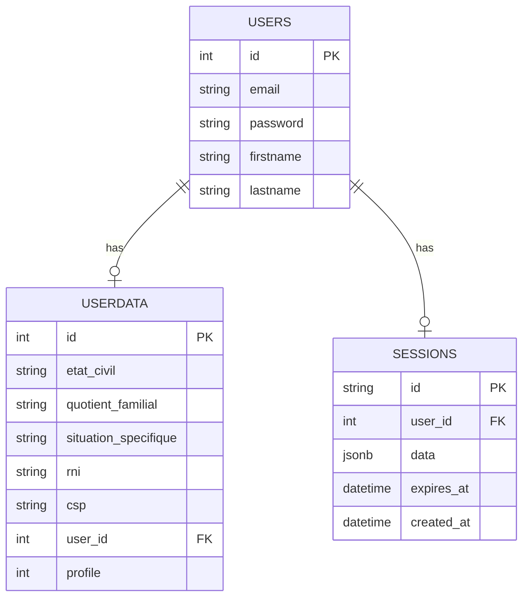

*This project has been created as part of the 42 curriculum by aherlaud, ldevigne, lflayeux, yukravch.*

# ft_transcendence (Fiscolia)

## Description

Fiscolia is a tax-declaration assistance platform built as a 42 ft_transcendence project. The goal of the project is to guide users through their fiscal declaration with a web application that combines authentication, user profiles, recommendation logic (Machine-Learning), and an AI-powered chatbot.

Key features:

- Secure authentication with server-side sessions stored in PostgreSQL.
- User profile management and profile creation tools.
- A chatbot service backed by Ollama.
- A training pipeline that produces a machine-learning model used for fiscal recommendation.
- Logging and observability services with Elasticsearch, Logstash, and Kibana.
- A reverse proxy that exposes the application over HTTPS.

## Instructions

### Prerequisites

- Docker
- Docker Compose
- GNU Make
- Python 3.11+ for the helper scripts and training utilities
- A valid `.env` file at the root of the repository

### Environment setup

1. Create the root `.env` file from the project configuration expected by the Docker Compose stack.
2. Create the secret files in `secrets/` if they are missing, using the provided `.example` files as a base.
3. Make sure Docker is running before starting the project.

### Run the project

1. Check the environment:

```bash
make env_check
```

2. Build and start all services:

```bash
make
```

3. Open the application in your browser:

```text
https://localhost
```

4. Open the Kibana dashboard if needed:

```text
https://localhost/kibana/app/dashboards
```

### Useful commands

- `make re` to rebuild and restart the stack.
- `make fclean` to stop and also remove everything stored inside the DB
- `make logs` to follow container logs.
- `make stop` to stop the stack.
- `make training` to run the ML training service and generate the model artifact.
- `make create_users` to create users through the helper container.
- `make create_profiles` to create profiles through the helper container.
- `make vector_db` to build the vector database used by the chatbot.

## Resources

### References

- FastAPI documentation: https://fastapi.tiangolo.com/
- React documentation: https://react.dev/
- Vite documentation: https://vite.dev/
- SQLAlchemy documentation: https://docs.sqlalchemy.org/
- PostgreSQL documentation: https://www.postgresql.org/docs/
- Docker documentation: https://docs.docker.com/
- Ollama documentation: https://docs.ollama.com/
- Elasticsearch, Logstash, and Kibana documentation: https://www.elastic.co/guide/
- WAF: https://www.cloudflare.com/learning/ddos/glossary/web-application-firewall-waf/
- HashiCorp Vault: https://developer.hashicorp.com/vault/docs/commands/kv

### AI usage

- AI was used to draft and structure this README from the existing repository layout, Makefile, Docker Compose stack, and ADR documents.
- AI was used to summarize the project architecture and turn the existing implementation details into a clear English description.
- AI was not used to implement the application logic itself in this README task.

## Team Information

Team members listed at the top of the README:

- `<aherlaud>` - Role: `Project Manager` - Responsibilities: Alexandre was in charge of scheduling meetings, and asked the team to ensure planning and deadlines were respected. He managed the team perfectly even when technical conflicts occured (for example due to hardware constraints). 
- `<ldevigne>` - Role: `Product Owner` - Responsibilities: Lucas main focus was to design features (mostly around ML and AI) and check with others if it was possible (or how to adapt the idea to the faisability of the project).
- `<lflayeux>` - Role: `Architect` - Responsibilities: Lorenzo was in charge of leading the core frame of the project, to implement tests (CI/CD), to make sure that logs were properly retrieved and overall that the project was runable.
- `<yukravch>` - Role: `Product Owner` - Responsibilities: Yulia had to implement major security features along with her interest for the product vision oriented fronted, leading to get a huge responsability for the website overall design. 

## Project Management

### Work organization

To keep it simple, we had 2 weekly meetings :
- 1 to discuss about issues encountered
- 1 peer-reviews : each member should explain the work done in the week to other members
The remaining work was very autonomous, and we made sure that everyone could use discord to ask questions, and it made things easier because of written mode. (We were able to search for specific topics, or read posted documentation).

### Tools used for project management

- Github
- Many youtube ressources for AI and ML comprehension, but also for the beginning on "how to build a full-stack website""
- Classic LLM such as Gemini and Claude mostly to explain specific questions about code syntax etc. 

### Communication channels

- Discord with categories and channels 

## Technical Stack

### Frontend

- React
- css
- Vite
- React Router

### Backend

- FastAPI
- Python
- SQLAlchemy
- Uvicorn

### Database

- PostgreSQL

PostgreSQL was chosen because it is already used as the core persistent store, it supports reliable server-side session management, and it fits the project architecture without requiring extra infrastructure such as Redis.

### Other notable technologies

- Docker and Docker Compose
- Ollama for local LLM inference
- Elasticsearch, Logstash, and Kibana for logging and dashboards
- PyTorch, NumPy, and pandas for the training pipeline
- WAF to protect the application layer
- HashiCorp Vault to stock the secrets

### Technical choices

- Server-side sessions are stored in PostgreSQL to keep authentication simple and persistent.
- The project is containerized to keep setup reproducible across the team.
- The chatbot is isolated in its own backend service so it can be evolved independently.
- The ML training pipeline is separated from runtime services to keep inference lightweight.

## Database Schema

### Overview

The main database objects visible in the repository are:

- `users`
- `userdata`
- `sessions`

### Relationships

- One user can have one profile record in `userdata`.
- One user can have one active session record in `sessions`.

### Main fields

- `users.id`: integer primary key
- `users.email`: unique email address
- `users.password`: password hash or stored credential value
- `users.firstname`, `users.lastname`: user identity fields
- `userdata.user_id`: foreign key to `users.id`
- `userdata.etat_civil`, `userdata.quotient_familial`, `userdata.situation_specifique`, `userdata.rni`, `userdata.csp`: fiscal profile fields
- `sessions.id`: UUID primary key
- `sessions.user_id`: foreign key to `users.id`
- `sessions.data`: JSONB session payload
- `sessions.expires_at`: session expiration timestamp
- `sessions.created_at`: creation timestamp

### Diagram



## Features List

### Implemented features

- Authentication and session management : user login, session storage, and protected access.
- User profile handling : creation and storage of user fiscal data.
- Chatbot interface : conversational assistant for guidance.
- ML training pipeline : generates the model artifact used by the recommendation engine.
- Logging stack : provides centralized logs and dashboards.

### Feature ownership

As we explained previously, features around AI/ML were mainly initiated by Lucas but also Alexandre (because these two have a lot of interest for this topic).
Yulia featured almost all the frontend by herself, but also Cybersecurity module.
Lorenzo was in charge of Docker, and all the logs (shoutout to him) : basically he managed all the DevOps tasks.

Let's dig deeper and be more specific :

- Lucas :
	- Featured the `Session` implementation + it's backend dependencies
	- Built an Auto-Encoder model trained on specific datas (provided by Alexandre)
	- Built the logic around the usage of Cookie (for login/logout but also help the chatbot with specific data)
	- Proposed to combine the powerness of the ML model to help the chatbot to get better results
	- Designed a solution for that suggestion using Python code and improving first feature of Webscoket provided by Alexandre.


- Alexandre :
	- Scripts for the automatization of fake users to get data inside `userdata` table
	- Implementation of the secure protocol of HTTPS
	- Creation of the RAG (with tools like chromaDB and LangChain)
	- WebSocket usage for the chatbot backend part

## Modules

### Chosen modules

- Web (Backend : all team | Frontend : Yulia)
	- Major: Use a framework for both the frontend and backend. (2 points) <-> React frontend | FastAPI backend
	- Major: Implement real-time features using WebSockets or similar technology. (2 points) <-> our chatbot uses WebSocket
	- Minor: Use an ORM for the database. (1 point) <-> SqlAlchemy used for this
	- Minor: Custom-made design system with reusable components, including a propercolor palette, typography, and icons (minimum: 10 reusable components). (1 point)

> We found this to be a very solid way to implement our idea : both backend and frontend frameworks do work nice together and are also very popular on the job market nowadays.

- Artificial Intelligence (Alexandre & Lucas)
	- Major: Implement a complete RAG (Retrieval-Augmented Generation) system. (2 points) <-> we used ChromaDB mostly
	- Major: Implement a complete LLM system interface. (2 points) <-> we chose llama3.2:1b that is powered by an Ollama service
	- Major: Recommendation system using machine learning. (2 points) <-> the creation of the neural network can always grow depending on the data inside `userdata`.

> We first chose to user mistral:latest LLM model : even if the model went smooth on our personnal computers, it was too needy at school, even more with all the other services that had to run together. We faced a hard constraint then and moved to llama3.2:1b which of course is not very 'smart' but works and demonstrate how this project works. We are aware that the answers given by the LLM are often inacurrate but it's mainly due to this hardware limitation rather than a misconception in the code.

- Cybersecurity (Yulia)
	- Major: Implement WAF/ModSecurity (hardened) + HashiCorp Vault for secrets (2 points)

- Devops (Lorenzo)
	- Major: Infrastructure for log management using ELK (Elasticsearch, Logstash, Kibana) (2 points)
	- Major: Backend as microservices. (2 points)

- Modules of choice
	- Major: Smart Contextual Cookies & Multi-Session Management : (Lucas) (2 points)
		- To provide a seamless User Experience (UX), we implemented a "Smart Cookie" system. This module goes beyond standard authentication by persisting user sessions safely (eliminating repetitive logins) and embedding lightweight user profile metadata to instantly feed our Machine Learning recommendation engine upon page load.
		- Implementing this robustly required solving advanced state and security challenges:
			- **Simultaneous Multi-User Handling:** Standard cookies often overwrite each other when multiple accounts are used on the same browser. We developed a custom session-partitioning mechanism. It perfectly isolates concurrent users and ensures that logging out of one account selectively destroys only the associated encrypted data without affecting other active sessions.
			- **Security & Tamper-Proofing:** Storing profile data client-side introduces high risks of XSS, CSRF, and data falsification (e.g., a user altering their ML profile). Lucas addressed this by enforcing strict security flags (`HttpOnly`, `Secure`, `SameSite=Strict`) and cryptographically signing/encrypting the cookie payload.
			- **ML Payload Optimization:** We had to carefully serialize and compress the user profile features so they fit within the strict 4KB HTTP cookie size limit while remaining instantly readable by our system.
		- This module directly impacts both system performance and security. It acts as a local cache that drastically reduces database overhead for our ML recommendations, while managing edge cases like multi-session browser sharing and secure state destruction. Because it bridges authentication, client-side cryptography, and performance optimization, it represents a substantial technical effort that deserves Major module status.

	> This choice was a solid approach to understand how to use Cookies. Even if we could get more technical with backend to avoid this choice, this design made all the navigation pretty smooth and secure. In the future we even may take a more specific look at prompt injection issues (which may be caused only by the fact that the backend communicates with ollama about the data stored inside the user's cookie, so nothing is really problematic). Moreover, the cookie only stores the session_id and anything related to a direct password or any data from the server itself. We managed to create a stateful token inside the cookie, that is deleted if the user logout, or if the cookie expires (which is calculated on the server side).

	- Minor: Universal VM Compatibility & Optimization : (all team) (1 point)
		- We wanted to ensure our project was accessible to anyone, regardless of their host operating system (Linux, macOS, Windows) or hardware limitations. By designing the project to be fully runnable inside a standard Virtual Machine (VM), we eliminate the "it works on my machine" syndrome and guarantee a uniform behavior during evaluation.
		- Making a project seamlessly runnable inside a VM is not trivial and required addressing several constraints:
			- **Resource Constraints:** We optimized our code (memory management and CPU usage) to ensure smooth performance even within a single-core, low-RAM virtual environment.
			- **Display & I/O Emulation:** We configured the project to handle software rendering and network port forwarding properly, bypassing the lack of native hardware/GPU acceleration inside basic VMs.
			- **Dependency Isolation:** We packaged and scripted the environment setup so that no host-level library conflicts could break the execution.
		- This module grants almost every hardware setup the ability to run and test our project under identical conditions. It acts as a bridge for continuous integration (CI) compatibility and demonstrates our team's ability to cross-compile, optimize for restricted environments, and manage system-level abstractions. This technical effort to ensure robust portability justifies its status as a Minor module.

### Point calculation

Total : 21 points

## Additional Notes

- The project is launched through Docker Compose from the repository root.
- The main orchestration file is [srcs/docker-compose.yml](srcs/docker-compose.yml).
- The root automation entry point is the [Makefile](Makefile).