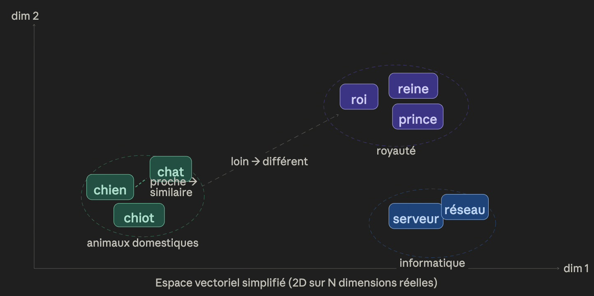
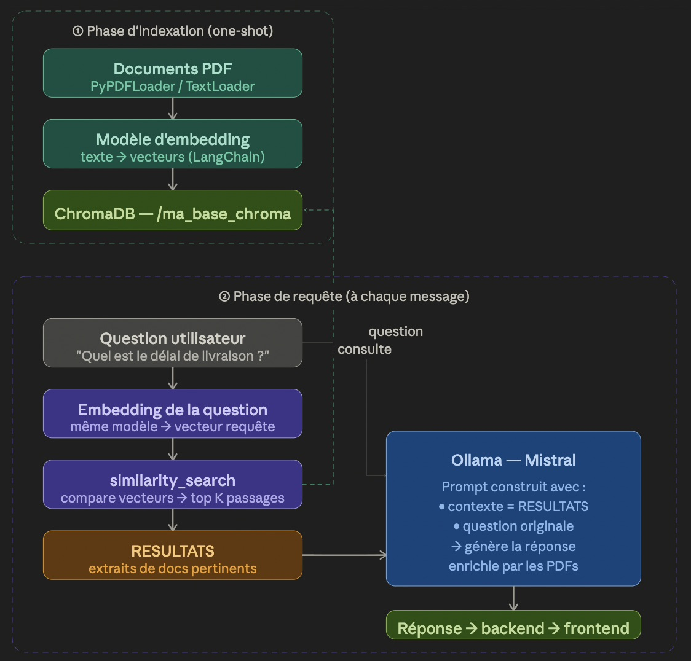
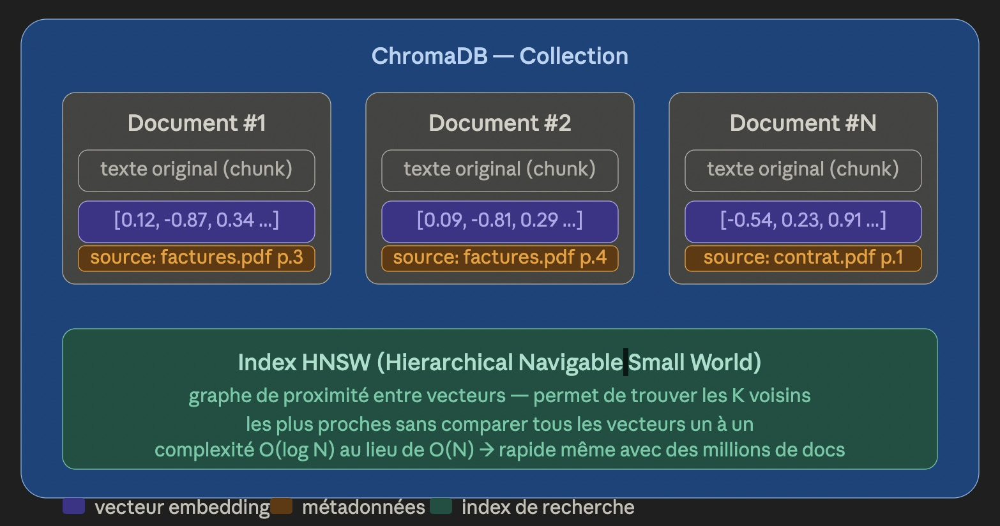

# Review — Architecture RAG + Chatbot

## Les deux microservices

Le backend repose sur deux microservices qui communiquent avec le frontend :

**Ollama** est un service qui isole et expose un serveur HTTP permettant de télécharger (*pull*) puis d'exécuter (*run*) un modèle LLM open source — ici `mistral:latest`. Il abstrait toute la complexité de l'exécution du modèle : gestion GPU/CPU, chargement des poids, inférence. Le frontend (ou notre backend chatbot) lui envoie simplement une requête HTTP avec un prompt, et reçoit une réponse générée.

**Chatbot (backend FastAPI)** est le cerveau de l'application. Il orchestre le pipeline RAG complet :

- **FastAPI** : framework Python léger pour exposer nos endpoints REST au frontend.
- **ChromaDB** : base de données vectorielle qui stocke notre RAG (on y reviendra).
- **LangChain** : bibliothèque open source qui fournit des modules prêts à l'emploi pour les tâches IA courantes — chargement de documents (`TextLoader`, `PyPDFLoader`), création d'embeddings, connexion à ChromaDB, construction du pipeline de requête. On l'utilise à la place d'une intégration manuelle avec `pymupdf`.
- La base vectorielle est persistée localement dans le dossier `/ma_base_chroma` sur le serveur.

---

## Comment fonctionnent les embeddings ?

C'est le concept central à comprendre. Un **embedding** est une transformation qui convertit un texte (mot, phrase, paragraphe) en un vecteur de nombres — typiquement des centaines ou milliers de dimensions. Le principe clé : **deux textes sémantiquement proches produiront des vecteurs proches dans cet espace**.En pratique, un vecteur d'embedding ressemble à `[0.12, -0.87, 0.34, 0.05, ...]` avec souvent énormément de dimensions. La "proximité" se mesure par la **similarité cosinus** : deux vecteurs qui pointent dans la même direction sont sémantiquement proches, même si leurs valeurs absolues diffèrent. C'est ce mécanisme que ChromaDB utilise pour retrouver les passages pertinents.



---

## Process RAG — pipeline complet**Détail du pipeline :**

La phase d'indexation est effectuée une seule fois (ou à chaque ajout de document) : les PDFs sont découpés en chunks, chaque chunk est converti en vecteur par le modèle d'embedding, et l'ensemble est stocké dans ChromaDB. La base résultante <u>associe chaque chunk de texte à son vecteur</u>.

À chaque requête utilisateur, la même transformation est appliquée à la question. ChromaDB compare ce vecteur-requête à tous les vecteurs stockés via `similarity_search`, retourne les K passages les plus proches (les RESULTATS), et Ollama construit une réponse en s'appuyant sur ce contexte documentaire + la question originale.


---

## Comment fonctionne ChromaDB ?

ChromaDB est une base de données vectorielle open source, conçue spécifiquement pour stocker et interroger des embeddings efficacement.

Voici ce qui la différencie d'une base relationnelle classique :


**Ce que stocke ChromaDB pour chaque chunk :**

Chaque entrée dans ChromaDB contient trois choses :
- le `texte brut` original (pour pouvoir le renvoyer à Ollama en contexte)
- son `vecteur d'embedding` (pour faire la recherche par similarité)
- et des `métadonnées optionnelles` (nom du fichier source, numéro de page, date...). Ces métadonnées permettent aussi de filtrer les résultats avant la recherche vectorielle — utile si on veut chercher uniquement dans un document précis.

**L'index HNSW** est l'algorithme qui rend la `recherche rapide`.

Plutôt que de comparer la question à chaque vecteur stocké un par un (O(N), impraticable à l'échelle), il maintient un `graphe de proximité` entre les vecteurs et navigue ce graphe pour atteindre les voisins les plus proches en O(log N).
> ChromaDB gère cet index automatiquement : on lui donne des documents, il se charge du reste.

En résumé, `similarity_search` dans notre code fait :


```mermaid
flowchart LR
    A[embedding de la question] --> B[navigation HNSW]
    B --> C[retour des K chunks les plus proches avec leur texte]
	C --> D[transmission à Ollama comme contexte]