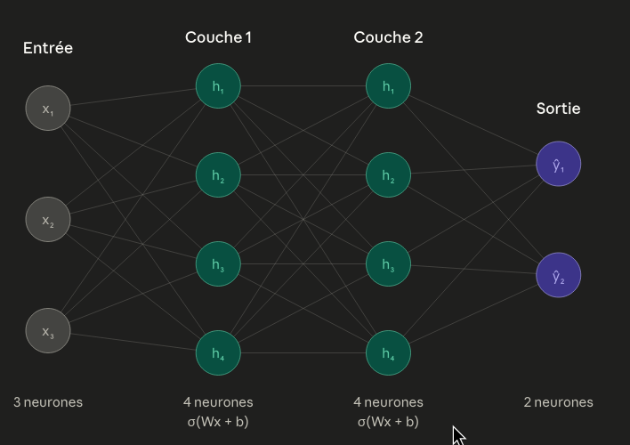
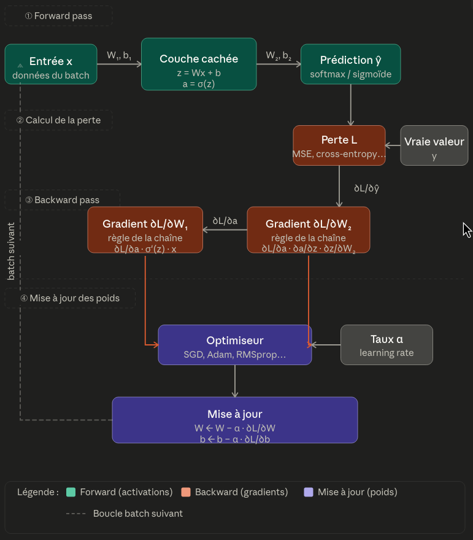
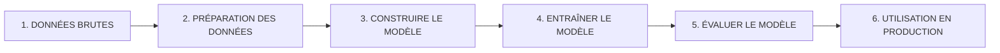
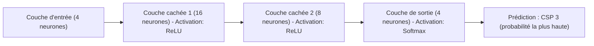

# Review — Machine Learning et Deep Learning : Les Bases

## Qu'est-ce que le Deep Learning ?

Le Deep Learning (DL) est une sous-catégorie du Machine Learning qui utilise des **réseaux de neurones avec plusieurs couches**.

### Types de tâches en Machine Learning

1. **Régression** : Prédire un nombre continu (prix d'une maison, température)
2. **Classification** : Prédire une catégorie (spam/pas spam, chat/chien, 0-9)
3. **Clustering** : Grouper les données similaires ensemble
4. **Génération** : Créer du nouveau contenu (images, texte)

### Le Modèle MLP (Multi-Layer Perceptron) - Modèle Vanille

Le MLP est le modèle de Deep Learning le plus basique et compréhensible :



**Analogie** :
- Chaque neurone reçoit des signaux (inputs)
- Il combine ces signaux et produit un signal de sortie
- Les connexions entre neurones ont des "forces" (weights) qui peuvent être fortes ou faibles
- Le réseau apprend en ajustant ces forces

---

## Qu'est-ce que l'entraînement d'un modèle ?

### Vue d'ensemble générale

L'entraînement est le processus où le modèle **apprend à partir des données**.

### Les composants clés

#### 1. **Les Poids (Weights) et Biais (Bias)**

Chaque connexion entre deux neurones a une **force** appelée **poids** (weight). Un neurone a aussi une **tendance naturelle** appelée **biais** (bias).

**Formule de transformation** : `output = (input × weight) + bias`

#### 2. **Les Fonctions d'Activation**

Après la transformation linéaire, on applique une **fonction d'activation** qui ajoute de la **non-linéarité**. Sans elle, peu importe le nombre de couches, le réseau resterait linéaire.

**Fonction courante** :

- **ReLU (Rectified Linear Unit)** : Si la valeur est négative, on retourne 0. Sinon, on retourne la valeur. Très populaire.

#### 3. **Processus d'un pas d'entraînement**



Pour chaque batch de données :

1. **Forward Pass** (Propagation avant) :
   - Les données d'entrée traversent le réseau couche par couche
   - Chaque couche applique : `output = activation(input × weights + bias)`
   - À la fin, on obtient une prédiction

2. **Calcul de l'erreur** :
   - On compare la prédiction à la vraie réponse
   - On mesure l'écart (fonction de perte, voir ci-dessous)

3. **Backward Pass** (Rétropropagation) :
   - On calcule comment chaque poids contribue à l'erreur (voir section Backpropagation)
   - On obtient la direction à suivre pour améliorer chaque poids

4. **Mise à jour des poids** :
   - On ajuste légèrement chaque poids dans la bonne direction
   - On utilise un optimiseur (voir ci-dessous)

---

## Backpropagation en détails

### Qu'est-ce que la Backpropagation ?

**L'idée** : 
- On sait combien le modèle s'est trompé (l'erreur globale)
- On remonte dans le réseau à l'envers pour voir comment chaque poids a causé cette erreur
- On ajuste chaque poids pour réduire l'erreur


### La Fonction de Perte (Loss Function)

La **fonction de perte** mesure **à quel point le modèle s'est trompé**. Elle transforme l'écart entre la prédiction et la vraie réponse en un nombre.

<!-- **Fonctions courantes** :

- **MSE (Mean Squared Error)** : Pour les régressions. Calcule l'écart moyen au carré.
  - Utile quand on prédit des nombres continus
  
- **Cross-Entropy** : Pour les classifications. Mesure la différence entre les probabilités prédites et réelles.
  - Utile quand on doit choisir entre plusieurs catégories -->

### Les Optimiseurs

Un **optimiseur** décide **comment et de combien ajuster les poids** basé sur l'erreur calculée par backpropagation.

<!-- #### **Gradient Descent**

C'est le plus simple. L'idée : pour chaque poids, on l'ajuste un peu dans la direction qui réduit l'erreur.

**Taille du pas** : Plus le pas est grand, plus on change vite. Trop grand = on dépasse la solution. Trop petit = c'est lent.

**Inconvénient** : Utilise TOUTES les données. C'est précis mais lent avec de grandes données. -->

---

## Pipeline global d'un modèle basique avec exemple

### Architecture générale du pipeline



### Exemple concret : Prédire la CSP (Catégorie Socio-Professionnelle)

Utilisons notre dataset comme exemple.

**Données disponibles** :
- État civil (1-5)
- Quotient Familial (1-6)
- Situation spécifique (1-4)
- RNI (Revenu, nombre continu ~10 000-120 000)

#### **Étape 1 : Les données brutes**

```
Index | État civil | Quotient | Situation | RNI   
1     | 2          | 4        | 3         | 116410
2     | 4          | 5        | 1         | 96124 
... (100 lignes)
```

#### **Étape 2 : Préparation**

```
Avant normalisation : RNI entre 10 146 et 119 915
Après normalisation : RNI entre 0 et 1

Résultat : 4 entrées (État civil, Quotient, Situation, RNI)
           1 sortie (CSP : 1, 2, 3, ou 4)

Division : 80 exemples pour l'entraînement, 20 pour le test
```

#### **Étape 3 : Architecture du modèle**

On décide de construire ce réseau simple :



**Explication** :
- **4 neurones d'entrée** : nos 4 features
- **2 couches cachées** : pour capturer les patterns complexes
- **4 neurones de sortie** : un pour chaque classe CSP (1, 2, 3, 4)

#### **Étape 4 : Entraînement**

**Vérifier les détails dans la section Processus d'un pas d'entraînement**

#### **Étape 5 : Évaluation après entraînement (50 époque)**

Après avoir montré tous les 80 exemples d'entraînement 50 fois :

```
Résultats sur les données d'entraînement :
- Accuracy : 95 %  (il devine bien quand il a vu les données)

Résultats sur les données de TEST (jamais vues) :
- Accuracy : 87 %  (un peu moins bon, mais raisonnable)
```
#### **Étape 6 : Utilisation en production**

Un nouvel utilisateur arrive avec ses données :

```
Nouvelles données : [État civil = 2, Quotient = 5, Situation = 2, RNI = 75 000]

1. Normaliser le RNI : 75 000 → 0.63
2. Passer par le modèle entraîné : Forward pass
3. Obtenir : [0.05, 0.1, 0.75, 0.1]
4. Prédiction : CSP = 3 (probabilité 75 %)

Résultat : Cette personne appartient probablement à la CSP 3
```
